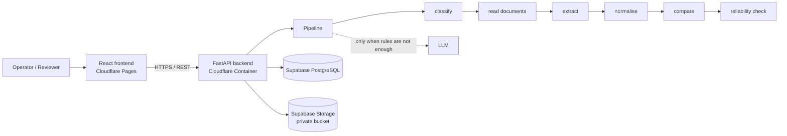

# SDOC — Shipping Document Verification

**Built by team CodeBlack for the Averis × Monash Hackathon.**

SDOC reads a shipping operations inbox, finds the emails that ask for a document check, compares the Shipping Instruction (SI) against the draft Bill of Lading (BL), and reports exactly which fields disagree — before the BL is finalised. When it can't reach a dependable answer, it sends the case to a person instead of guessing.

**Live app:** https://codeblack.online
**API:** https://sdoc-backend.teamcodeblack9.workers.dev/api/health

---

## The problem

A shipping team's inbox mixes document-check requests, new SI requests, invoice questions, general updates and spam. For every document-check request, someone has to open two documents and compare names, ports, container counts and weights by hand. It is slow, repetitive, and a single missed discrepancy means corrections, delays and extra cost.

The same information also looks different across documents: one says "Port of Loading", the other "Load Port"; one writes `ABC CO., LTD`, the other `ABC CO LTD`. A useful system has to tell a real discrepancy from a formatting difference.

## What SDOC does

1. **Classifies every email** into one of five categories: `BL_COMPARISON`, `SI_REQUEST`, `INVOICE_QUERY`, `GENERAL`, `SPAM`. Only document-check requests continue.
2. **Reads the attachments** — plain text, PDF, Word and Excel.
3. **Extracts seven shipment fields** from the SI and the BL: shipper, consignee, notify party, port of loading, port of discharge, container count, gross weight (kg).
4. **Normalises and compares** them, with the SI as the reference.
5. **Reports the result:**
   - `OK` — "No mismatch detected."
   - `MISMATCH` — the exact fields that differ, SI and BL side by side
   - `NEEDS_REVIEW` — with a reason: missing attachment, unreadable document, wrong document type, or missing value
6. **Lets a reviewer confirm or correct** extracted values; the backend re-checks and updates the result.

### Design principle

**AI is for understanding; deterministic code is for decisions.** Rules run first for classification and extraction; the language model is only called when rules can't handle messy or ambiguous content. Normalisation, comparison, status and routing to review are plain Python, so every verdict is backed by a deterministic rule.

## Features

- **Dashboard** — totals, results by category and status, most common discrepancies, emails that need attention
- **Inbox** — server-side filters (category, result, processing state, batch), search, pagination
- **SI vs BL comparison** — the seven fields in a fixed order, with only the backend-reported defect fields highlighted
- **Document preview** — PDF and text attachments shown next to the comparison
- **Human review queue** — plain-language reasons, editable SI/BL values, re-check on save
- **Upload** — a whole dataset as a `.zip` bundle, `.eml` / JSON emails, or a single email with its documents
- **Batch progress** — live progress, speed, estimated time remaining, and results for that batch
- **Export** — CSV, JSON, or the organiser submission format
- Responsive layout for desktop and mobile

## Architecture



| Layer | Technology | Hosting |
|---|---|---|
| Frontend | React, TypeScript, Vite, Tailwind CSS v4, TanStack Query | Cloudflare Pages |
| Backend | Python, FastAPI, Pydantic | Cloudflare Containers (Docker) |
| Database | Supabase PostgreSQL | Supabase |
| Documents | Supabase Storage (private bucket, signed URLs only) | Supabase |
| Parsing | PyMuPDF, python-docx, openpyxl | — |
| AI | LLM via OpenCode API, used only as a fallback | — |

The frontend never computes a verification result. It renders what the backend returns, and it never holds database or AI credentials.

## Repository structure

```
.
├── README.md
├── PROJECT_RULES.md          Team contract: architecture, data model, ownership
├── .env.example              Variable names only, no values
├── backend/
│   ├── main.py               FastAPI routes
│   ├── config.py             Settings from environment variables
│   ├── models.py             Canonical Pydantic models (EmailResult, ShipmentFields)
│   ├── database.py           Supabase persistence
│   ├── orchestration.py      Processing lifecycle (pending → processing → completed / failed)
│   ├── llm.py, prompts.py    LLM client and prompts
│   ├── loader.py             Organiser-provided loader (unmodified)
│   ├── import_organizer_data.py
│   ├── schema.sql
│   ├── Dockerfile
│   ├── pipeline/             classify, documents, extract, normalize, compare, reliability, run
│   └── test_*.py
├── docs/                     API notes for upload, batch and export
├── evaluation/               Full-dataset runs, submission builder, scorer client
├── frontend/
│   ├── src/                  App, API client, types, components
│   ├── public/               Favicon, SPA routing
│   └── package.json
├── src/index.js              Cloudflare Worker that fronts the backend container
├── wrangler.jsonc            Worker and container configuration
└── package.json              Worker tooling (wrangler)
```

## Data model

Every processed email produces one `EmailResult`:

```json
{
  "email_id": "email_004",
  "category": "BL_COMPARISON",
  "status": "MISMATCH",
  "si": { "consignee": "EAST BRIGHT FZ-LLC", "container_count": 6, "...": "..." },
  "bl": { "consignee": "UAB NOVAKOPA", "container_count": 6, "...": "..." },
  "defect_fields": ["consignee", "notify_party"],
  "has_defect": true,
  "review_reason": null,
  "decided_by": "rule",
  "notes": null
}
```

`processing_status` (`pending`, `processing`, `completed`, `failed`) is tracked separately; a result is only shown once processing is `completed`.

## API

| Method | Path | Purpose |
|---|---|---|
| GET | `/api/health` | Health check |
| GET | `/api/emails` | List emails. Filters: `status`, `category`, `processing_status`, `batch_id`; paging: `limit`, `offset`; total in `X-Total-Count` |
| GET | `/api/emails/count` | Count with the same filters |
| GET | `/api/emails/{email_id}` | One email with its result |
| GET | `/api/emails/{email_id}/attachments` | Attachment list |
| GET | `/api/documents/signed-url?path=` | Short-lived signed URL for an attachment |
| POST | `/api/emails/{email_id}/process` | Process one email |
| POST | `/api/emails/{email_id}/retry` | Retry a failed email |
| PATCH | `/api/emails/{email_id}/review` | Reviewer correction; the backend re-checks |
| POST | `/api/emails/upload` | Upload a dataset bundle, emails, or a single email with documents |
| GET | `/api/batches/{batch_id}` | Batch progress |
| GET | `/api/emails/export?format=csv\|json\|submission` | Export results (same filters as the list) |

### Upload format

A dataset bundle is a `.zip` with the same layout as the organiser data:

```
dataset.zip
├── inbox/          email_001.json, email_002.json, …
└── attachments/    email_004_SI.txt, email_004_BL.pdf, …
```

Each email JSON has `email_id`, `from`, `subject`, `body` and `attachments` (relative paths). Limits: 20 files per upload, 25 MB per file, 100 MB per upload. Bundles are processed in the background as a batch; emails get a batch-scoped id so a new dataset never overwrites an old one.

## Running locally

### Prerequisites

- Python 3.12
- Node.js 20 or newer
- A Supabase project and an OpenCode API key (ask the team; never commit them)

### Backend

```bash
cd backend
python3 -m venv .venv
source .venv/bin/activate            # Windows: .venv\Scripts\Activate.ps1
pip install -r requirements.txt
cp ../.env.example .env              # then fill in the values
uvicorn main:app --reload --port 8000
```

Required variables (names only): `SUPABASE_URL`, `SUPABASE_KEY`, `OPENCODE_API_KEY`, `OPENCODE_MODEL`, `FRONTEND_URL`, `APP_ENV`.

Tests (pytest is in `evaluation/requirements-dev.txt`, not in the backend runtime requirements):

```bash
cd backend
pip install -r ../evaluation/requirements-dev.txt
python -m pytest
```

### Frontend

```bash
cd frontend
npm install
echo "VITE_API_BASE_URL=http://localhost:8000" > .env.local
npm run dev                           # http://localhost:5173
```

To use the deployed backend instead, set `VITE_API_BASE_URL=https://sdoc-backend.teamcodeblack9.workers.dev`. Open the app at `http://localhost:5173` exactly: the backend's CORS allows that origin, and `127.0.0.1` counts as a different one.

## Deployment

- **Backend:** Docker image in a Cloudflare Container, fronted by a Worker. Secrets are stored as Cloudflare secrets; `FRONTEND_URL` sets the allowed CORS origin.
- **Frontend:** built with `VITE_API_BASE_URL` pointing at the backend, deployed to Cloudflare Pages:

```bash
cd frontend
npm run build
npx wrangler pages deploy dist --project-name codeblack-sdoc
```

## Evaluation

`evaluation/` runs the pipeline over the full organiser dataset, projects the results into the organiser submission format, and submits them to the organiser's self-evaluation endpoint. Run each script with `--help` for its options.

The answer key is never opened, read or used by any code in this repository; accuracy is measured only through the organiser's scoring endpoint.

## Human review

The system never guesses when the evidence is insufficient. A case goes to review when:

| Reason | Meaning |
|---|---|
| `missing_attachment` | The SI or BL attachment is missing |
| `unreadable` | An attachment could not be read |
| `wrong_doc_type` | An attachment is not an SI or a BL |
| `missing_value` | A required field is missing from a document |

The reviewer sees the extracted values and the source documents, corrects what is wrong, and the backend re-runs the comparison.

## Security

- No credentials in the repository; `.env` files are git-ignored and only `.env.example` (names, no values) is committed.
- The frontend talks only to the API and never receives database or AI keys.
- Attachments stay in a private bucket and are opened through short-lived signed URLs.
- Uploads are validated for size, count and file type; archives are checked for unsafe paths.

## Team CodeBlack

| Member | Role |
|---|---|
| _Name_ | AI and document pipeline — classification, parsing, extraction, normalisation, comparison |
| Rehan | Backend, database and cloud deployment |
| Muhammad Hawasmir | Frontend and product UI |
| Hussain | Evaluation, upload, export and batch processing |
